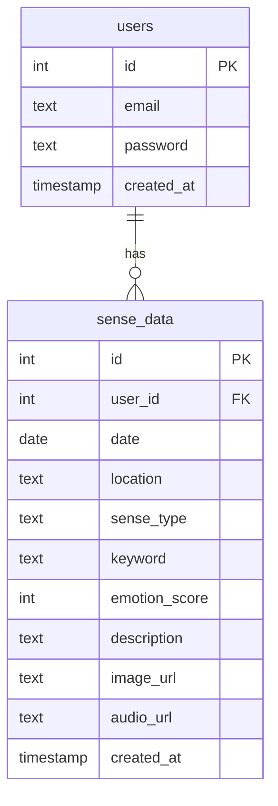

# 🗄️ Sense Journey - DB 스키마 정의서 (Database Schema)

> 감각 기록 시스템의 핵심 테이블 구조 및 관계(ERD) 정의  
> FastAPI + SQLAlchemy 연동을 고려한 설계 기준

---

## ✅ 테이블 목록

| 테이블명       | 설명                         |
|----------------|------------------------------|
| `users`        | 사용자 정보                  |
| `sense_data`   | 감각 기록 (주요 데이터 테이블) |

---

## 📋 1. users 테이블

| 필드명     | 타입      | 제약조건        | 설명           |
|------------|-----------|------------------|----------------|
| `id`       | INTEGER   | PRIMARY KEY      | 사용자 고유 ID |
| `email`    | TEXT      | UNIQUE, NOT NULL | 이메일         |
| `password` | TEXT      | NOT NULL         | 암호화된 비밀번호 |
| `created_at` | TIMESTAMP | DEFAULT now()   | 가입 일자      |

---

## 📋 2. sense_data 테이블

| 필드명         | 타입      | 제약조건         | 설명                     |
|----------------|-----------|------------------|--------------------------|
| `id`           | INTEGER   | PRIMARY KEY      | 기록 고유 ID             |
| `user_id`      | INTEGER   | FOREIGN KEY → users(id) | 작성자 ID 참조 |
| `date`         | DATE      | NOT NULL         | 체험 일자                |
| `location`     | TEXT      | NOT NULL         | 장소                     |
| `sense_type`   | TEXT      | NOT NULL         | 감각 유형 (시각 등)      |
| `keyword`      | TEXT      |                  | 키워드 (콤마로 구분)     |
| `emotion_score`| INTEGER   | CHECK(-5 <= x <= 5) | 감정 점수           |
| `description`  | TEXT      |                  | 체험 설명                |
| `image_url`    | TEXT      |                  | 이미지 링크              |
| `audio_url`    | TEXT      |                  | 오디오 링크              |
| `created_at`   | TIMESTAMP | DEFAULT now()    | 기록 작성 시간           |

---

## 🔁 관계도 (ERD 요약)



## 🧩 ORM 매핑 예시 (Python SQLAlchemy)

```
class SenseData(Base):
    __tablename__ = "sense_data"

    id = Column(Integer, primary_key=True, index=True)
    user_id = Column(Integer, ForeignKey("users.id"))
    date = Column(Date)
    location = Column(String)
    sense_type = Column(String)
    keyword = Column(String)
    emotion_score = Column(Integer)
    description = Column(String)
    image_url = Column(String)
    audio_url = Column(String)
    created_at = Column(DateTime, default=datetime.utcnow)
```

### 👨‍💻 작성자
** 기훈 김 (Kihun Kim) **
** 데이터 모델링 / ORM 설계 / ERD 설계 담당 **
